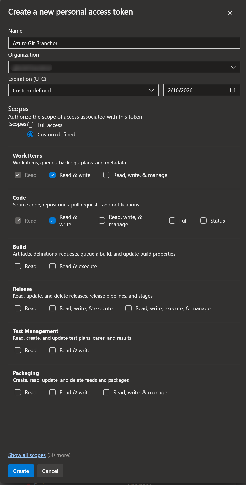

# azure-git-brancher README

Icons provided by [Icons8](https://icons8.com)

Creates a git branch in the format below when provided with a work item number:

`{workItemNumber}-{workItemTitle}`

The branch name goes through a few transformations to make it more git friendly:

- Trim additional spaces
- Replace spaces with dashes
- Lowercase the branch name

## Requirements

### Generate Azure DevOps Personal Access Token

- Work Items (Read & write)[^1]
- Code (Read & write)[^2]

[^1]: Only used create/get work items
[^2]: Only used to create PRs

In the Vscode settings, you will need to provide the following:

- `azure-git-brancher.organization`: The name of your Azure DevOps organization
- `azure-git-brancher.pat`: Your Azure DevOps Personal Access Token
