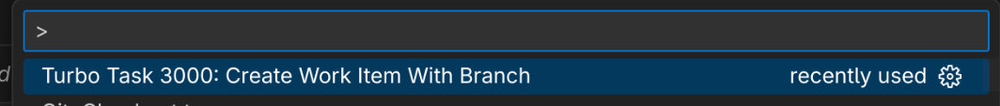
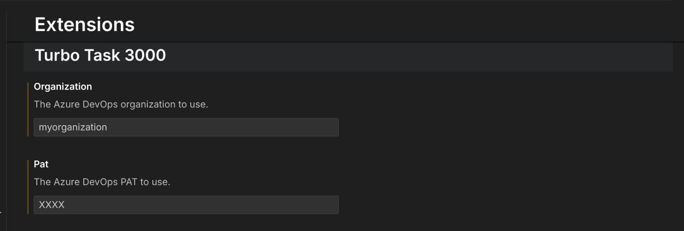

# Turbo Task 3000

## Purpose

To reduce the friction of creating a work item and then popping back over to VS Code to create a branch for that work item.

This extension allows you to create a work item in Azure DevOps and then automatically creates a git branch based on the work item number and title.

The extension is triggered by the command `Turbo Task 3000: Create Work Item`, which can be found in the Command Palette (Ctrl+Shift+P).

## Usage

To use the extension, follow these steps:

1. Open the Command Palette in VS Code (Ctrl+Shift+P).
2. Type `Turbo Task 3000: Create Work Item` and select it.
3. Fill in the name of the work item you want to create. (Currently, only "Task" work items are supported.)



It will also pull the `git config user.email` and assign the newly created work item to that email address, so you can easily track who created the work item.

Git branches will be created in the format:

```
<work-item-number>-<work-item-title>
```

The branch name goes through a few transformations to make it more git friendly:

- Trim additional spaces
- Replace spaces with dashes
- Lowercase the branch name

## Configuration

To configure the extension, you will need to provide your Azure DevOps organization name and Personal Access Token (PAT) in the VS Code settings.

The Personal Access Token should have the following permissions:

- Work Items (Read & write)


